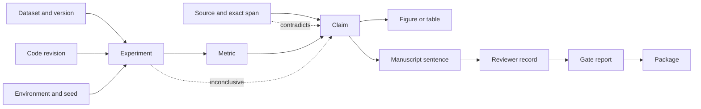

# HowHow-Reasoner — Product Requirements Document

> **Sản phẩm:** HowHow, một proactive, evidence-first Research OS và assistant.
> **Tài liệu:** PRD chuẩn hóa cho product và MVP.
> **Trạng thái:** `APPROVED FOR INTEGRATION SPIKE` — approved direction, chưa chọn primary runtime.
> **Ngày:** 2026-08-23
> **Final state label:** `READY FOR HUMAN REVIEW`

## 1. Tóm tắt và nguyên tắc

HowHow nhận một prompt tự nhiên mô tả ý tưởng nghiên cứu, rồi chủ động brief, tìm literature, phân tích gap/novelty, đề xuất candidate/hypothesis, reproduce baseline, implement, chạy bounded experiments, phân tích, critique, iterate, viết manuscript, tạo figures/tables, review, kiểm tra reproducibility/license/privacy, compile LaTeX và tạo arXiv package. Người dùng chủ yếu xem proposal/result và nói `continue`; hệ thống chỉ hỏi ở các ranh giới có hậu quả.

**Định vị một câu:** HowHow biến một câu hỏi nghiên cứu có giới hạn thành một research episode có evidence, run provenance, failure history và manuscript package có thể kiểm tra; provider và runner vẫn thay thế được.

### Guiding principles

1. **Evidence before prose:** không có source span, run hoặc manifest thì không được biến thành factual claim.
2. **Autonomy within consent:** tự động trong brief, budget, permissions và stop policy đã duyệt; không tự cấp quyền.
3. **Reuse before rebuild:** adapt/wrap/compose open source, Skills, MCPs, APIs, libraries, services và bounded workers; không tạo repo collage hay fork lớn sớm.
4. **One canonical truth:** HowHow sở hữu durable state, events, provenance, gates và approvals; adapter không tạo nguồn sự thật thứ hai.
5. **Failures are evidence:** failed, rejected và inconclusive paths được giữ, phân loại và học lại; không chỉ giữ best run.
6. **Truthful readiness:** package-ready không đồng nghĩa novel, correct, accepted, safe hay submitted.
7. **Human-owned consequential decisions:** hướng nghiên cứu, sensitive/legal/ethical actions, meaningful spend và publication authority cần người chịu trách nhiệm.
8. **Portable by construction:** artifacts, schemas và records phải export/rebuild được khi provider, OS hoặc orchestrator thay đổi.

## 2. Vấn đề, người dùng và phạm vi

### Problem statement

Công cụ hiện có mạnh ở từng đoạn: search, PDF/RAG, coding, experiment tracking, writing hoặc orchestration. Nhưng handoff giữa chúng làm mất source span, hypothesis rationale, frozen evaluation, failed runs, claim lineage, license context và approval history. Người nghiên cứu phải tự nối chat, paper, code, logs và manuscript; “paper-ready” dễ bị nhầm là evidence-backed hoặc scientifically correct.

### Initial target user

Applied-ML engineer, graduate student nâng cao hoặc nhóm nghiên cứu nhỏ có một research question, code/data công khai hoặc được phép dùng, và một local/remote compute environment. MVP không nhắm “mọi lĩnh vực”, wet lab, clinical automation hay unrestricted any-domain autonomy.

### Jobs-to-be-done

- Biến ý tưởng mơ hồ thành brief, scope, success criteria và stop conditions.
- Biết prior art nào hỗ trợ, mâu thuẫn hoặc gần nhất với candidate direction.
- Chọn hướng đáng thử trước khi tiêu tốn compute, thời gian hoặc uy tín.
- Reproduce baseline, chạy intervention có evaluation contract và lưu cả thất bại.
- Truy ngược từng claim, number, figure và paragraph về evidence hoặc run.
- Resume/take over/stop mà không mất lịch sử hoặc tạo duplicate execution.
- Nhận một package có thể review, build lại và kiểm tra quyền sử dụng.

### Product promise

Từ một prompt, HowHow tạo một brief có thể sửa, evidence plan, candidate comparison, approved experiment loop, claim-evidence map và paper package. HowHow không hứa guaranteed novelty, correctness, statistical significance, peer-review acceptance hay automatic publication.

### Goals

- Một user journey liền mạch từ Idea đến `READY FOR HUMAN REVIEW`.
- Durable, append-only provenance cho source, evidence, task, run, claim, review và package.
- Routine work chạy proactive; consequential ambiguity được hỏi đúng lúc.
- Provider-neutral runtime với Firstmate + Herdr là lựa chọn ưu tiên khi readiness pass, Pi là fallback explicit.
- MVP chứng minh một bounded applied-ML Research Episode / Evidence Ledger.

### Non-goals và truthful boundaries

- Không xây lại AI Scientist, search engine, Zotero, paper editor hoặc full workflow platform.
- Không tự tuyên bố novelty, truth, safety, acceptance hoặc publish.
- Không chạy code/repository không tin cậy với host credentials, unrestricted network hay unlimited budget.
- Không tự submit arXiv; con người quyết định publication.
- Không silent fallback, silent scope drift, silent duplicate execution hoặc false provider identity.
- Không đưa toàn bộ external repositories vào monorepo; license của software không tự cấp quyền cho papers, datasets, PDFs, models hoặc figures.

## 3. Canonical user experience

### Nguyên tắc tương tác

Người dùng thấy một conversational intake, brief preview, plan/progress, evidence cards, candidate comparison, experiment board, manuscript evidence gutter, review inbox và release review. Agent topology, raw prompts, leases, provider logs và graph traversal nằm trong `Inspect details`, không phải default UX.

Default cockpit luôn hiển thị current stage, last meaningful artifact, one recommended next action, spend/time, blocker, evidence/artifact counts và `pause / take over / stop-and-preserve`.

### Progressive briefing

HowHow hỏi tối đa các câu hỏi cần thiết để xác định:

- điều muốn học/test/make và outcome hữu ích;
- scope, non-goals, audience, deadline và supported domain;
- data/code được phép dùng, consent và retention;
- internet, provider, MCP, GPU/cloud, secrets và network policy;
- budget, time, stop conditions và publication constraints.

Sau đó tạo `ResearchBrief` versioned: interpreted question, assumptions, source boundary, evidence plan, proposed stages, permissions, risks, budget reservation, expected artifacts và unresolved ambiguities. Brief material change phải có plan diff và approval mới.

### Defaults và approval policy

Routine local reads, bounded literature retrieval đã cho phép và low-risk analysis có thể chạy theo brief. Mặc định deny: sensitive/dual-use work, new data source, external credentials, network ngoài allowlist, cloud/GPU spend vượt reservation, destructive mutation, redistribution of protected material và publication/submission.

HowHow phải hỏi trước direction selection, confirmatory experiment plan, meaningful spend, ethical/legal ambiguity, material manuscript claims nếu policy chưa pre-authorize, và final release. User có thể cấp policy trước; policy luôn giới hạn bởi hard safety gates.

### Controls

- **Pause:** không tạo work mới; safe tasks kết thúc hoặc bị cancel theo policy; checkpoint được lưu; resume sau khi revalidate.
- **Resume:** kiểm tra checkpoint, lease, budget, provider readiness, source freshness và policy trước khi tiếp tục.
- **Take over:** dừng autonomy, mở brief/files/results cho người sửa; mọi edits có actor và event.
- **Stop-and-preserve:** ngừng automation/spend, giữ toàn bộ events/runs/artifacts/failures, đánh dấu inactive; không xóa.
- **Cancel:** là một durable event với reason và deadline; late completion được giữ như late evidence nhưng không đổi cancelled task thành success.
- **Advanced diagnostics:** raw events, TaskSpec/TaskResult, provider/model version, prompt/tool hashes, lease/heartbeat, sandbox, retries, resource cost và reviewer context.

### User journey

```mermaid
flowchart LR
 I[Idea] --> B[Brief]
 B --> F[Capability safety feasibility]
 F --> E[Evidence plan and literature]
 E --> C[Candidate directions]
 C --> A[Human direction approval]
 A --> BL[Baseline]
 BL --> L[Locked experiment plan]
 L --> X[Bounded experiment loop]
 X --> G[Findings and claim map]
 G --> M[Manuscript figures tables]
 M --> R[Independent review and revision]
 R --> Q[Reproducibility license privacy package QA]
 Q --> H[READY FOR HUMAN REVIEW]
 H --> D[Human decision]
 D -->|revise| M
 D -->|archive| AR[ARCHIVED]
 D -->|submit manually| P[Human-owned publication]
```



## 4. Research loop và state model

Research không phải DAG tuyến tính. Discovery có thể quay lại sau critique; reviewer có thể mở literature query; weak evidence có thể quay về hypothesis, baseline hoặc experiment design. Mỗi loop có max iterations, wall time, API/GPU/storage budget, retry limit, concurrency limit và no-progress detector. Repeated equivalent actions without new evidence phải pause hoặc `WAITING_FOR_HUMAN`.

### Nested loops

- **Discovery:** query → retrieve → deduplicate/version → read → extract spans → citation/contradiction expansion → coverage audit.
- **Idea/novelty:** gap → candidates → nearest-work comparison → feasibility/risk/cost/falsifier → direction approval.
- **Experiment:** design → implementation → sandbox review → baseline → run → metric validation → analysis → diagnosis → ablation/reproduction.
- **Evidence:** claim → support/contradiction → provenance audit → confidence/limitations → revise claim or create task.
- **Writing:** outline → claim-linked draft → citation/number/figure audit → review → revision.
- **Governance:** gate → pass, pass-with-limitations, revise, block, reject hoặc human escalation.

### User-visible statuses

`INTAKE`, `BRIEFING`, `SCOPING`, `LITERATURE`, `CANDIDATES`, `WAITING_FOR_HUMAN`, `BASELINE`, `EXPERIMENTING`, `ANALYZING`, `WRITING`, `REVIEW`, `REPRODUCIBILITY`, `PACKAGING`, `READY FOR HUMAN REVIEW`, `PAUSED`, `BLOCKED`, `FAILED`, `INCONCLUSIVE`, `CANCELLED`, `ARCHIVED`.

`FAILED` phân biệt transient/provider, environment/runner, code, data/evaluation, security/policy và terminal budget failure. `INCONCLUSIVE` là kết quả nghiên cứu hợp lệ nhưng chưa đủ evidence; không được rewrite thành success. `CANCELLED` giữ artifacts. `ARCHIVED` là lifecycle end do người dùng/policy, không phải xóa.

### Recovery và failure memory

Mỗi failure lưu symptom, attempt, diagnosis, evidence, cost, attempted fixes, lesson, avoid scope và supersession. Retry chỉ tự động với failure idempotent/retryable. Unknown side effect, ambiguous dispatch, security failure hoặc budget exhaustion phải block. No-progress memory ngăn lặp lại cùng cấu hình mà không có information gain.

## 5. Functional requirements

| Nhóm | Requirements bắt buộc |
|---|---|
| Intake/planning | Tạo/version `ResearchBrief`; parse scope/non-goals; capability, safety, feasibility triage; evidence plan; candidate comparison; approvals, budgets, permissions và stop conditions. |
| Literature/evidence | Adapter cho arXiv, Semantic Scholar/OpenAlex/Crossref và local/Zotero; stable IDs, versions/retractions, retrieval timestamp, raw hash, access/license status, exact span/locator; dedupe và contradiction search. |
| Hypothesis/novelty | Tạo nhiều candidates/hypotheses; nearest prior-art matrix; uncertainty, feasibility, cost, risks, falsifier; không tự gọi candidate là novel; lưu `Decision` và human selection. |
| Experiments | Baseline trước intervention; immutable evaluation/metric/seed/split; sandboxed runner; exploratory/confirmatory label; manifests, logs, resource usage, artifacts, failed attempts, bounded rerun và resume. |
| Analysis/statistics | Reproducible metric calculation; uncertainty, seed sensitivity, leakage/confound, multiple comparisons, sample/power policy khi áp dụng; negative/inconclusive findings; generated figures/tables từ recorded outputs. |
| Writing/figures/tables | Claim-linked outline/manuscript; citation and evidence gutter; paragraph-to-claim mapping; generated numbers/figures/tables; limitations và disclosures; LaTeX build. |
| Review | Separate context/evidence snapshots; novelty, methodology, statistics, reproducibility, citation/claim và adversarial review; severity, dissent, contradiction, issue owner/resolution; meta-review không được xóa dissent. |
| Publication packaging | Clean compile; bibliography/metadata/figures/supplement checks; source archive; reproducibility, license/privacy, checksum và manifest; stop tại exact label `READY FOR HUMAN REVIEW`; human submits manually. |
| Human control | Brief/direction/budget/permission approvals; pause/resume/take-over/stop-and-preserve; explicit fallback; final decision approve/revise/archive/submit; user data preservation. |
| Observability | Correlate `project_id`, `task_id`, `run_id`, `event_id`, `artifact_id`, provider/model/policy; structured logs, costs, retries, queue latency, progress, gate outcomes, stale leases, failure classes và audit export. |

## 6. Research OS architecture và authority

```mermaid
flowchart TB
 UX[Conversational UX and review surfaces] --> RD[Research Director and policy]
 RD --> CR[Capability Registry and readiness]
 RD --> CP[Canonical control plane]
 CP --> EV[Append-only events and rebuildable state]
 CP --> PR[Claims evidence runs reviews approvals budgets]
 RD --> AD[Provider adapters Skills MCP APIs]
 AD --> RUN[Sandboxed runners and worktrees]
 RUN --> ART[Immutable artifact manifests and content hashes]
 ART --> CP
 MEM[Research memory and provenance] <--> CP
 RUN -. never authority .-> CP
```



**Research Director** lập kế hoạch, tạo tasks, chọn allowed next action, phân bổ budget đã reserve, yêu cầu review và đề xuất transitions. Director không được fabricate evidence, mutate raw runs, bypass gate, grant permission, self-approve publication, erase failure hay chạy arbitrary code ngoài sandbox.

**Canonical records:**

- `ResearchBrief`: question, scope, constraints, permissions, ethics, budgets, stop conditions, outputs, version.
- `TaskSpec` / `TaskResult`: bounded objective, inputs, capabilities, sandbox, budget, approval refs, idempotency, output artifacts, status/failure/provider.
- `SourceRecord` / `EvidenceSpan`: stable IDs, provider, version, retrieval/hash/access/license, exact page/section/quote/table locator.
- `Hypothesis` / `Decision`: proposal, alternatives, assumptions, evidence, falsifier, status, decision owner/rationale.
- `RunManifest` / `ArtifactManifest`: code/data/environment/command/seed/metric/resource identity, outputs, hashes, parent artifacts, retention.
- `ClaimRecord`: wording, type (`external`, `empirical`, `interpretive`, `hypothesis`), status, support/contradiction edges, limitations.
- `ReviewRecord` / `GateReport`: rubric, evidence snapshot, model/provider/version, prompt hash, findings, severity, dissent, gate result and policy version.
- `ApprovalRecord`: actor, scope, timestamp, expiry, evidence reviewed, budget/permission authority.
- `BudgetReservation`: resource kind, limit, owner, reservation, spent, remaining, hard/soft boundary.
- `ArtifactManifest`: content hash, media/type, producer, parents, license/access, path and reproducibility metadata.

`events/events.jsonl` là append-only history. `state/project.yaml` là rebuildable projection, không phải sole truth. State có thể rebuild từ events + immutable artifacts sau crash.

## 7. Runtime và multi-agent policy

### Capability Registry

Registry versioned/hashes static capabilities và dynamic readiness: protocol/API, task kinds, platform, sandbox, network, artifact transport, cancellation/resume, concurrency, budget, model/tools, executable identity, workspace, auth và current capacity. Mỗi capability là `supported`, `degraded` hoặc `unknown` với evidence và expiry. `unknown` không đủ để chạy safety-sensitive task.

Selection phải validate contract, approval, budget và dependencies; query readiness; chọn provider deterministic; reserve lease/budget; dispatch một lần theo `(task_id, attempt, idempotency_key)`; persist provider handle; rồi mới mark running.

### Provider disposition

| Provider/substrate | Vai trò | Quy tắc |
|---|---|---|
| Firstmate + Herdr | Preferred parallel operational runtime | Chỉ chọn khi readiness, lease, artifact và cancellation contracts pass; native state không phải semantic completion. |
| Pi subagents | Explicit fallback | Cùng TaskSpec/TaskResult; label chính xác `pi-subagent`; không silent swap; dùng GPT-5.6 Luna/medium khi được dispatch theo project policy. |
| Codex | Implementation/tool/model worker | Không là canonical scheduler; sandbox và typed artifacts bắt buộc. |
| DeepScientist / DeerFlow | Replaceable substrate candidates | Adapter/bake-off; không để internal state làm source of truth; không fork trước khi audit. |
| ARIS, Academic Paper Skills, latex-arxiv-SKILL | Pinned reusable Skills/procedures | Pin exact repo/commit; adapt artifact conventions; Skill không phải evidence oracle/scheduler. |
| APIs/MCP/PaperQA2/Zotero | Evidence/library adapters | Read-only mặc định; normalize IDs/spans/hashes/access; output prose không authoritative. |

Không có silent fallback. Fallback chỉ hợp lệ nếu readiness fail trước accepted dispatch, hoặc typed retryable infrastructure failure chứng minh không có side effect. Ambiguous dispatch/unknown handle/possible external effect → `reconcile_required` hoặc `BLOCKED`; không dispatch provider khác. Serial degradation (`concurrency=1`) phải giữ nguyên gates, records, budgets và truthful estimate.

### Leases, fencing, idempotency, heartbeat, cancellation

Lease gồm task, attempt, provider, handle, owner epoch, expiry, heartbeat sequence và fencing token. Chỉ current token được commit result. Heartbeat phải có semantic progress/checkpoint/resource usage; idle không tự chứng minh task complete. Cancellation là event bền vững; late result có thể lưu nhưng không đổi status trái policy. Reconciliation kiểm tra handle, checkpoint, artifacts, side effects và budget trước retry.

## 8. Research memory và claim-evidence provenance

Memory tách thành semantic (concepts/papers), episodic (task/run/review), procedural (skills/protocols), failure, decision và evidence. Mỗi record có provenance, confidence/limitations, freshness, scope và supersession. Embedding chỉ là retrieval aid; canonical records không bị thay thế.



External claim phải trỏ `SourceRecord + EvidenceSpan`. Empirical claim phải trỏ `RunManifest + metric + artifact`. Figure/table phải trỏ generated artifact và source data. Paragraph phải trỏ claims. Reviewer phải trỏ evidence snapshot và issue. Contradictions, unsupported hypotheses và dissent không bị collapse thành một confidence badge.

## 9. Reuse/integration disposition

| System | Primary link | HowHow disposition | License/security/update boundary |
|---|---|---|---|
| ARIS | [repo](https://github.com/RandallTan-RT/Auto-research-in-sleep) | Reuse idea/experiment/review/paper Skills | Pin exact identity/commit; similarly named mirrors không interchangeable; audit license. |
| Codex | [OpenAI](https://openai.com/codex/) | Bounded implementation/research worker | No canonical state; sandbox, egress, secrets, model/version và artifact manifest. |
| Firstmate/Herdr | local operational runtime | Preferred dispatch substrate | Readiness/protocol/lease/identity checks; no lifecycle driving from unguarded task; provider state ≠ task truth. |
| Pi | [Pi harness](https://github.com/badlogic/pi-mono) | Explicit fallback subagent | Truthful provider label, same contracts, no duplicate after ambiguous dispatch. |
| DeepScientist | [repo](https://github.com/ResearAI/DeepScientist) | Highest-priority substrate adapter spike | Commit-level license/dependency/API/security audit; no fork or dual state. |
| DeerFlow | [repo](https://github.com/bytedance/deer-flow) | Second substrate candidate | Fast-moving API/sandbox/provider surface; pin and export canonical artifacts. |
| PaperQA2 | [repo](https://github.com/Future-House/paper-qa) | Optional evidence worker | Exact spans/page/hash/parser/version; corpus/model/provider terms separate. |
| Scholarly APIs/MCP | [arXiv](https://info.arxiv.org/help/api/index.html), [Semantic Scholar](https://api.semanticscholar.org/api-docs/), [OpenAlex](https://docs.openalex.org/), [Crossref](https://api.crossref.org/) | Foundation read-only adapters | Rate limits, mutable metadata, retractions, access and full-text rights; cache raw responses. |
| Zotero | [API](https://www.zotero.org/support/dev/web_api/v3/start) | Read-only user-library adapter | Client/license and user PDF rights separate; library metadata ≠ evidence authority. |
| AI Scientist | [repo](https://github.com/SakanaAI/AI-Scientist) | Bounded experiment/reference | Separate v1/v2 code/model/data terms; containerize LLM code; do not copy wholesale. |
| autoresearch | [repo](https://github.com/karpathy/autoresearch) | Immutable evaluation/fixed-budget pattern | Reimplement semantics in RunManifest; resolve exact license before reuse. |
| data-to-paper | [repo](https://github.com/Technion-Kishony-lab/data-to-paper) | Traceability benchmark/reference | Human/domain review remains; preserve backward data/code chain. |
| Academic Paper Skills | [repo](https://github.com/DELONG-L/Academic-Paper-Skills) | Writing, figures, tables, review Skill | Pin, smoke-test and attribute; does not replace citation/experiment verification. |
| latex-arxiv-SKILL | [repo](https://github.com/appautomaton/latex-arxiv-SKILL) | LaTeX/package QA Skill | Clean build and citation checks only; not scientific-validity proof; pin toolchain. |
| Selective experiment/publication tooling | [DVC](https://github.com/iterative/dvc), [MLflow](https://github.com/mlflow/mlflow), [Hydra](https://github.com/facebookresearch/hydra), [Overleaf](https://www.overleaf.com/) | Adapter only when measured useful | Avoid dual sources of truth; retain HowHow manifests/export; review telemetry and licenses. |

No dependency is admitted by popularity or a product claim. Exact commit, license, dependency lock, security owner, update path, data/model/PDF rights and export test are required. Personal use does not waive licenses.

## 10. Quality gates và readiness semantics

Each gate returns `PASS`, `PASS_WITH_LIMITATIONS`, `REVISE`, `BLOCKED` hoặc `REJECT`, with checks, evidence refs, policy version and dissent.

1. **Scope/safety:** question, non-goals, ethics, consent, permissions, stop conditions.
2. **Literature:** stable IDs, versions, spans, access status, date cutoff, dedupe, contradictions/retractions.
3. **Novelty:** nearest-work comparison, search limitations, uncertainty; never unsupported “first”.
4. **Design:** hypotheses, baseline, metric, split, seeds, confounders, ablations, analysis plan.
5. **Execution integrity:** sandbox, code/data/environment/command identity, budget, logs, artifacts.
6. **Results/statistics:** metric integrity, uncertainty, leakage, sensitivity, negative/inconclusive result handling.
7. **Claim-evidence:** every material claim supported, contested or explicitly hypothesis/interpretation.
8. **Figures/tables:** regenerated from recorded outputs; numbers agree with claims and raw results.
9. **Independent review:** separate context/evidence snapshot and recorded reviewer/provider/model; critical dissent unresolved blocks.
10. **Reproducibility:** clean rerun or explicit bounded exception with limitation.
11. **License/privacy:** source/data/model/code/figure rights, retention, anonymization and attribution.
12. **Package:** LaTeX, bibliography, metadata, source archive, checksums, manifest and required outputs.
13. **Human authority:** human reviewed package and decides what happens next.

`READY FOR HUMAN REVIEW` means package, evidence trail, limitations và review records are available for a human. It does **not** mean novel, correct, accepted, safe to publish, or submitted. Package checks and scientific correctness are separate labels. Reviewer contradictions/dissent remain immutable and visible.

## 11. Non-functional requirements

- **Local-first/portable:** work offline where data/provider policy permits; project export readable on Windows/Linux; no provider lock-in.
- **Security:** least privilege; untrusted papers/repos treated as data; sandbox/VM/container; deny-by-default egress; allowlisted APIs; no ambient secrets; dependency and MCP pinning; prompt-injection resistance; kill switch.
- **Privacy/retention:** local default for unpublished work; explicit retention/deletion policy; content access and redistribution rights recorded per artifact; deletion must not rewrite audit history.
- **Reproducibility:** code revision, data/version/hash, environment/lockfile/container, commands, seeds, hardware, metrics, manifests and rerun recipe.
- **Reliability/recovery:** append-only events, checkpoints, leases, fencing, idempotency, typed retries, reconciliation, stale worker handling, preserved failures.
- **Budget enforcement:** reserve before dispatch; track tokens/API/GPU/wall/storage/concurrency; hard stop at policy limit; no silent upgrade or spend.
- **Observability:** correlated structured events, provider identity, resource cost, stage progress, gate result, queue/lease state, failure class and exportable audit.
- **Provider portability:** adapters exchange canonical contracts; changing provider changes explicit observation only; no false identity.
- **Accessibility/UX simplicity:** plain-language statuses, keyboard-accessible review controls, progressive disclosure, visible next action, no agent-theater default.
- **Performance:** responsiveness is measured by task class and artifact availability; do not promise fake fixed latency. Progress must mean durable evidence/checkpoint, not tokens or spinner percentage.

## 12. Canonical project layout và `dist/`

```text
project/
├── PROJECT.md
├── policy/                         # safety, network, retention, license, budgets
├── state/project.yaml              # rebuildable projection
├── events/events.jsonl             # append-only source history
├── tasks/{queued,running,done,blocked}/
├── approvals/
├── literature/{sources,raw,notes,matrix,indices}/
├── hypotheses/  ├── decisions/  ├── claims/  └── evidence/
├── experiments/<run-id>/{manifest.json,logs,metrics,outputs}/
├── memory/{semantic,episodic,procedural,failure,decisions}/
├── reviews/
├── paper/{sections,figures,tables,main.tex,references.bib,supplementary}/
├── manifests/
└── dist/
```

Expected arXiv-ready `dist/` outputs:

```text
dist/
├── paper.pdf
├── arxiv-source.zip
├── main.tex
├── references.bib
├── figures/
├── tables/
├── supplementary/
├── CLAIM_EVIDENCE_MAP.md
├── EXPERIMENT_LOG.md
├── REPRODUCIBILITY.md
├── REVIEW_REPORT.md
├── GATE_REPORT.md
├── LICENSE_ACCESS_MANIFEST.md
├── ARXIV_CHECKLIST.md
├── build.log
└── checksums.txt
```

Source archive phải build từ clean directory, không absolute local paths/hidden dependencies. `dist/` là handoff package; HowHow không submit.

## 13. MVP: one bounded applied-ML Research Episode

### Scope

Một public applied-ML question, một benchmark/dataset, một local hoặc remote runner, arXiv + một metadata provider, baseline + intervention, một deliberately failed run, hai hypotheses, một human-selected direction, một locked evaluation plan, một bounded revision, hai separated reviews, generated figure/table và LaTeX package.

### Integration bake-off candidates

1. Minimal direct runner — control case.
2. Codex + pinned Skills + direct APIs/one read-only MCP.
3. Firstmate + Herdr when readiness passes.
4. Pi-subagent explicit fallback.
5. DeepScientist or DeerFlow adapter, one at a time.

### Pass/fail criteria

- **Evidence:** stable IDs, timestamps, hashes, access status, duplicate/version handling, exact spans; injected instructions cannot execute.
- **Execution:** complete manifests, immutable evaluation, failure retained, no duplicate side effect, budget/network/worktree boundaries enforced, clean rerun within declared tolerance.
- **Claims/review:** external/empirical/interpretive/unsupported types preserved; all links resolve; dissent visible; malformed outputs rejected.
- **Package:** generated values consistent; citations resolve; clean compile; license/access manifest; export independent of provider.
- **Hard fail:** execution escape, fabricated evidence, missing identity, lost failure, silent fallback, automatic publication, ambiguous dispatch followed by duplicate run.

Score 0/1 per criterion; reject a candidate below the agreed threshold or any hard failure. Tie-break by smallest adapter, lowest license/security burden and least irreversible coupling. This bake-off evaluates integration, không tuyên bố scientific novelty.

### MVP acceptance criteria

- Intake creates versioned brief and approval history.
- Pause/resume and stop-and-preserve retain events, artifacts and failed attempts.
- Every material claim has resolvable evidence path or explicit unsupported status.
- Baseline/intervention comparison is reproducible and budget-bound.
- Provider replacement changes adapter/provider metadata, not canonical records.
- User can inspect source spans, code/data/environment, run logs, reviewers and package.
- Final state is exactly `READY FOR HUMAN REVIEW`; no automatic submission.

### MVP non-goals

Any-domain research, guaranteed novelty, clinical/wet-lab autonomy, multi-user collaboration, public marketplace, large RAG corpus, graph database, distributed workflow engine, automatic cloud spend, automatic arXiv submit, and full agent dashboard.

### Phased roadmap

- **Phase 0 — contract/bake-off:** schemas, threat model, one domain, evidence/experiment fixtures, provider and license audit.
- **Phase 1 — filesystem control plane:** events, projection, tasks, checkpoint/resume, local runner, budgets, manifests, deterministic audit.
- **Phase 2 — evidence loop:** literature adapters, spans, claims, hypothesis/experiment records, failure memory, review board.
- **Phase 3 — publication loop:** figures/tables, claim/citation audit, clean LaTeX, reproducibility/license/privacy QA, export.
- **Phase 4 — measured scale:** remote/GPU runners, semantic retrieval, cross-project memory, selected substrates.

### Infrastructure triggers

- **SQLite:** when atomic leases, concurrent workers, indexed local queries or cost aggregation become a measured bottleneck; files remain exportable.
- **Workflow engine:** when distributed timers, retries, long-running workers and recovery cannot be safely maintained by filesystem queue; preserve HowHow event/evidence contracts.
- **Graph projection/database:** when repeated multi-hop cross-project claim/source/run queries or relationship integrity exceed practical file indexing; avoid dual-write ambiguity.

## 14. Risks và open decisions

### Risks and mitigations

| Risk | Mitigation |
|---|---|
| Hallucinated citation/result | Stable IDs, exact spans, raw hashes, claim gate, source re-fetch, unsupported label. |
| Prompt injection in paper/repository | Treat external text as untrusted; sandbox, egress allowlist, no secrets, tool permission boundary. |
| Duplicate or split-brain execution | Lease/fencing/idempotency/accepted handle/reconciliation; ambiguous dispatch blocks. |
| Runaway cost or loop | Reservation, hard limits, no-progress detector, iteration/time/retry caps, human escalation. |
| Correlated reviewer agreement | Separate evidence snapshots/context and preserve provider/model/prompt metadata and dissent. |
| License/rights violation | Exact commit audit plus per-artifact license/access manifest; no copying unclear-license code/PDF/model. |
| False readiness | Separate package gate from science; exact `READY FOR HUMAN REVIEW` semantics. |
| Provider drift | Adapter contracts, version pinning, capability registry, portable export and bake-off regression. |
| Data loss/privacy leakage | Local-first, immutable manifests, retention controls, no ambient credentials, encrypted/private storage policy. |
| Overbuilding infrastructure | Start filesystem-first; trigger SQLite/engine/graph only from measured workload. |

### Legitimately open decisions

- First applied-ML domain, dataset/benchmark and reproducibility tolerance.
- Exact ARIS repository/commit and selected Skills/MCPs.
- Windows-local vs remote Linux/GPU sandbox boundary.
- Human identity/approval UX and spend thresholds.
- Independent-review definition and readiness threshold.
- Source/PDF/data/model retention and redistribution policy.
- Allowed providers, telemetry, egress and secret policy.
- Bake-off score threshold and external substrate choice.
- Which metrics demonstrate meaningful progress and when to abandon a loop.

These remain open until measured or captain-approved; no agent may silently choose them.

## 15. Success measures và Definition of Done

### Success measures

Measure per episode: brief correction count, time to first useful evidence, source identity/span coverage, contradiction visibility, candidate decision quality, baseline reproduction, failed-run preservation, safe resume, duplicate-side-effect count, budget adherence, claim-to-evidence coverage, figure/table regeneration, clean-package success, reviewer critical-dissent resolution and provider portability. Avoid volatile prices, unsupported percentages or agent-count vanity metrics as requirements.

### Product Definition of Done

A phase is done only when:

1. all versioned records and transitions are schema-validated;
2. events rebuild the same state projection after restart;
3. evidence and artifacts are hashed, inspectable and rights-labeled;
4. task/run results are typed, provider-labelled and budget-accounted;
5. failure, pause, cancellation and ambiguous-dispatch behavior is tested;
6. quality gates retain limitations and dissent;
7. clean package checks pass independently from scientific correctness;
8. human approval remains required for publication;
9. MVP acceptance fixture passes without hard failure;
10. output ends with the exact state label **`READY FOR HUMAN REVIEW`**.

HowHow is complete as a product phase when a human can inspect the entire chain `question ↔ brief ↔ source/evidence ↔ hypothesis/decision ↔ code/data/environment ↔ experiment/metric ↔ figure/table ↔ claim ↔ reviewer ↔ manuscript ↔ package`, reproduce what the package claims within its declared limits, understand what remains unknown, and decide the next human-owned action.

### Web control-plane client

Run the typed local cockpit with `pnpm install --frozen-lockfile && pnpm dev`. Set `VITE_API_BASE_URL` (default `http://127.0.0.1:8000`) and `VITE_PROJECT_ID` when the control plane uses a different endpoint or project. The browser reads only the FastAPI API; it does not access project files directly.
